```mermaid
graph TD
    A["Development Phase Start"] --> B["SM: Reviews Previous Story Dev/QA Notes"]
    B --> B2["SM: Drafts Next Story from Sharded Epic + Architecture"]
    B2 --> S{"High-Risk Story? (Optional)"}
    S -->|Yes| T["QA: *risk + *design on Draft Story"]
    S -->|No| B3
    T --> U["Test Strategy & Risk Profile Created"]
    U --> B3{"PO: Validate Story Draft (Optional)"}
    B3 -->|Validation Requested| B4["PO: Validate Story Against Artifacts"]
    B3 -->|Skip Validation| C{"User Approval"}
    B4 --> C
    C -->|Approved| D["Dev: Sequential Task Execution"]
    C -->|Needs Changes| B2
    D --> E["Dev: Implement Tasks + Tests"]
    E --> V{"Mid-Dev QA Check? (Optional)"}
    V -->|Yes| W["QA: *trace or *nfr for Early Validation"]
    V -->|No| F
    W --> X["Dev: Address Coverage/NFR Gaps"]
    X --> F["Dev: Run All Validations"]
    F --> G["Dev: Mark Ready for Review + Add Notes"]
    G --> H{"User Verification"}
    H -->|Request QA Review| I["QA: Test Architect Review + Quality Gate"]
    H -->|Approve Without QA| M["IMPORTANT: Verify All Regression Tests and Linting are Passing"]
    I --> J["QA: Test Architecture Analysis + Active Refactoring"]
    J --> L{"QA Decision"}
    L -->|Needs Dev Work| D
    L -->|Approved| M
    H -->|Needs Fixes| D
    M --> N["IMPORTANT: COMMIT YOUR CHANGES BEFORE PROCEEDING!"]
    N --> Y{"Gate Update Needed?"}
    Y -->|Yes| Z["QA: *gate to Update Status"]
    Y -->|No| K
    Z --> K["Mark Story as Done"]
    K --> B

    style A fill:#f5f5f5,color:#000
    style B fill:#e8f5e9,color:#000
    style B2 fill:#e8f5e9,color:#000
    style S fill:#e3f2fd,color:#000
    style T fill:#ffd54f,color:#000
    style U fill:#ffd54f,color:#000
    style B3 fill:#e3f2fd,color:#000
    style B4 fill:#fce4ec,color:#000
    style C fill:#e3f2fd,color:#000
    style D fill:#e3f2fd,color:#000
    style E fill:#e3f2fd,color:#000
    style V fill:#e3f2fd,color:#000
    style W fill:#ffd54f,color:#000
    style X fill:#e3f2fd,color:#000
    style F fill:#e3f2fd,color:#000
    style G fill:#e3f2fd,color:#000
    style H fill:#e3f2fd,color:#000
    style I fill:#f9ab00,color:#fff
    style J fill:#ffd54f,color:#000
    style K fill:#34a853,color:#fff
    style L fill:#e3f2fd,color:#000
    style M fill:#ff5722,color:#fff
    style N fill:#d32f2f,color:#fff
    style Y fill:#e3f2fd,color:#000
    style Z fill:#ffd54f,color:#000
```

# bmad-method

## What Is BMad Method

BMad Method 是一种用于敏捷 AI 驱动规划与开发的方法论，它将项目生命周期分为两个主要阶段：规划工作流（Plan）和核心开发周期（Execute）。它鼓励在规划阶段使用强大的 Web Agent 以节省成本和提高质量，随后切换到 IDE 进行开发。

***

### 1. BMad 规划工作流 (Web UI/Agent)&#x20;

规划阶段旨在创建详细的项目文档和工件，为开发做好准备。

#### 核心流程

1. 项目启动: 从“项目想法”开始。
2. 可选分析: 分析师进行市场、竞争者研究，并创建项目简报。
3. PRD 创建: 项目经理 (PM) 根据简报创建 产品需求文档 (PRD)，包含功能需求 (FRs)、非功能需求 (NFRs)、史诗 (Epics) 和用户故事 (Stories)。
4. UX 与架构: UX 专家创建前端规范（如果需要），随后架构师创建系统架构。
5. 可选测试策略: QA 对高风险领域提供早期测试架构输入。
6. 文档校准: 产品负责人 (PO) 运行主清单，确保 PRD、架构和 Epics/Stories 文档一致。
7. 过渡: 规划完成后，切换到 IDE，PO 分片 (Shard) 文档。

```mermaid
graph TD
    A["Start: Project Idea"] --> B{"Optional: Analyst Research"}
    B -->|Yes| C["Analyst: Brainstorming (Optional)"]
    B -->|No| G{"Project Brief Available?"}
    C --> C2["Analyst: Market Research (Optional)"]
    C2 --> C3["Analyst: Competitor Analysis (Optional)"]
    C3 --> D["Analyst: Create Project Brief"]
    D --> G
    G -->|Yes| E["PM: Create PRD from Brief (Fast Track)"]
    G -->|No| E2["PM: Interactive PRD Creation (More Questions)"]
    E --> F["PRD Created with FRs, NFRs, Epics & Stories"]
    E2 --> F
    F --> F2{"UX Required?"}
    F2 -->|Yes| F3["UX Expert: Create Front End Spec"]
    F2 -->|No| H["Architect: Create Architecture from PRD"]
    F3 --> F4["UX Expert: Generate UI Prompt for Lovable/V0 (Optional)"]
    F4 --> H2["Architect: Create Architecture from PRD + UX Spec"]
    H --> Q{"Early Test Strategy? (Optional)"}
    H2 --> Q
    Q -->|Yes| R["QA: Early Test Architecture Input on High-Risk Areas"]
    Q -->|No| I
    R --> I["PO: Run Master Checklist"]
    I --> J{"Documents Aligned?"}
    J -->|Yes| K["Planning Complete"]
    J -->|No| L["PO: Update Epics & Stories"]
    L --> M["Update PRD/Architecture as needed"]
    M --> I
    K --> N["📁 Switch to IDE (If in a Web Agent Platform)"]
    N --> O["PO: Shard Documents"]
    O --> P["Ready for SM/Dev Cycle"]

    style A fill:#f5f5f5,color:#000
    style B fill:#e3f2fd,color:#000
    style C fill:#e8f5e9,color:#000
    style C2 fill:#e8f5e9,color:#000
    style C3 fill:#e8f5e9,color:#000
    style D fill:#e8f5e9,color:#000
    style E fill:#fff3e0,color:#000
    style E2 fill:#fff3e0,color:#000
    style F fill:#fff3e0,color:#000
    style F2 fill:#e3f2fd,color:#000
    style F3 fill:#e1f5fe,color:#000
    style F4 fill:#e1f5fe,color:#000
    style G fill:#e3f2fd,color:#000
    style H fill:#f3e5f5,color:#000
    style H2 fill:#f3e5f5,color:#000
    style Q fill:#e3f2fd,color:#000
    style R fill:#ffd54f,color:#000
    style I fill:#f9ab00,color:#fff
    style J fill:#e3f2fd,color:#000
    style K fill:#34a853,color:#fff
    style L fill:#f9ab00,color:#fff
    style M fill:#fff3e0,color:#000
    style N fill:#1a73e8,color:#fff
    style O fill:#f9ab00,color:#fff
    style P fill:#34a853,color:#fff
```

#### 规划工件（标准路径）

* PRD: `docs/prd.md`
* 架构: `docs/architecture.md`
* 分片后的 Epics/Stories: `docs/epics/` 和 `docs/stories/`
* QA 评估/关卡: `docs/qa/assessments/` 和 `docs/qa/gates/`

***

### 2. 核心开发周期 (IDE) 💻

开发阶段遵循迭代的、故事驱动的流程，高度依赖 AI Agent 的协助。

#### 核心流程

1. 故事起草: Scrum Master (SM) 根据分片的 Epics 和架构起草下一个用户故事。
2. 高风险检查 (可选): 如果故事是高风险的，QA Test Architect 进行 `*risk` 和 `*design`，创建测试策略和风险剖析。
3. 开发与测试: 开发人员 (Dev) 执行任务，实现代码和测试，并可进行 `*trace` (需求追踪) 或 `*nfr` (NFR 评估) 中期检查。
4. 提交流审: Dev 标记“Ready for Review”。
5. QA 审查: 用户请求 QA 审查，Test Architect (`@qa *review`) 进行全面评估、主动重构并发布质量关卡 (Quality Gate) 决策。
6. 迭代与完成: 如果 QA 失败或需要修复，返回开发；通过则验证回归测试和 Linting，提交变更，QA 更新关卡状态 (`*gate`)，并将故事标记为完成，然后循环到下一个故事。

***

### 3. BMad Agents

BMad 依赖一组具有特定角色的 Agent。

#### 主要 Agent

* `BMad-Master`: 万能 Agent，可执行除实际故事实现外的所有任务或命令。性能会随上下文增长而降低，建议常进行会话压缩。
* `BMad-Orchestrator`: 仅用于 Web 平台，重量级 Agent，用于协调 Web 捆绑包中的团队。
* 角色 Agent: 如 `@pm`, `@architect`, `@dev`, `@qa` (Test Architect) 等，用于执行特定的任务和命令。

#### Agent 工作方式

* 依赖系统: 每个 Agent 只加载它需要的资源（模板、任务、数据）以保持精简上下文。
* 交互: 在 IDE 中，Agent 交互通过 `@` 符号或斜杠命令 (`/`) 进行（取决于 IDE）。

***

### 4. Test Architect (QA Agent)

QA Agent 不仅仅是高级开发者审阅者，而是一个测试架构师 (Quinn)，专注于测试策略、质量关卡和风险测试。

#### 核心命令与用途

| 命令        | 别名                    | 阶段    | 目的               |
| --------- | --------------------- | ----- | ---------------- |
| `*risk`   | `*risk-profile`       | 故事起草前 | 最早识别和评估技术、安全等风险  |
| `*design` | `*test-design`        | 风险评估后 | 创建全面的测试场景和分级策略   |
| `*trace`  | `*trace-requirements` | 开发期间  | 验证测试覆盖率，确保满足需求   |
| `*nfr`    | `*nfr-assess`         | 开发期间  | 验证非功能需求（安全、性能等）  |
| `*review` | `*review`             | 开发完成  | 全面质量评估、主动重构、发布关卡 |
| `*gate`   | `*gate`               | 修复后   | 更新质量关卡状态         |

#### 质量关卡 (Gate Status)

* PASS: 满足所有关键要求。
* CONCERNS: 发现非关键问题，建议团队审查。
* FAIL: 发现关键问题（如安全风险，P0 测试缺失），必须解决。
* WAIVED: 问题已知并被团队明确接受（需记录理由和批准人）。

***

### 5. 安装与配置

* nodejs
* Git
* (可选) VS Code 插件：Markdown All in One + Markdown Preview Mermaid Support

#### 安装

运行 `npx bmad-method install` 进行交互式安装。

#### IDE 集成

* 支持 OpenCode 和 Codex (CLI & Web)，通过配置文件（如 `opencode.jsonc` 或 `AGENTS.md`）集成 Agent 和命令。
* 技术偏好: 可通过 `.bmad-core/data/technical-preferences.md` 文件影响 PM 和 Architect 的推荐。
* 核心配置: `.bmad-core/core-config.yaml` 中的 `devLoadAlwaysFiles` 定义了 Dev Agent 始终加载到上下文中的文件（如编码标准），以保持 Agent 的一致性行为。
